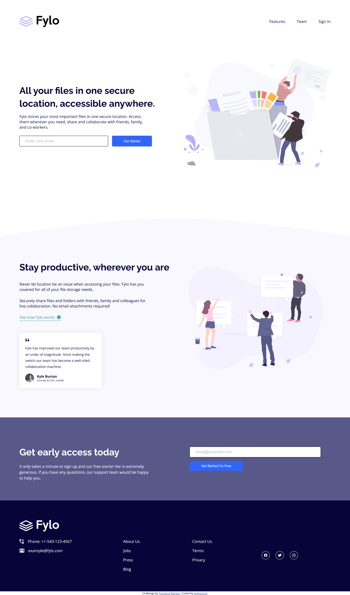

# Frontend Mentor - Fylo landing page with two column layout solution

This is a solution to the [Fylo landing page with two column layout challenge on Frontend Mentor](https://www.frontendmentor.io/challenges/fylo-landing-page-with-two-column-layout-5ca5ef041e82137ec91a50f5). Frontend Mentor challenges help you improve your coding skills by building realistic projects.

### Screenshot

### Links

[- Solution URL](https://github.com/wolvsrcool/Frontend-Mentor/tree/master/fylo-landing-page-with-two-column-layout-master)  
[- Live Site URL](https://wolvsrcool.github.io/Frontend-Mentor/fylo-landing-page-with-two-column-layout-master/index.html)
