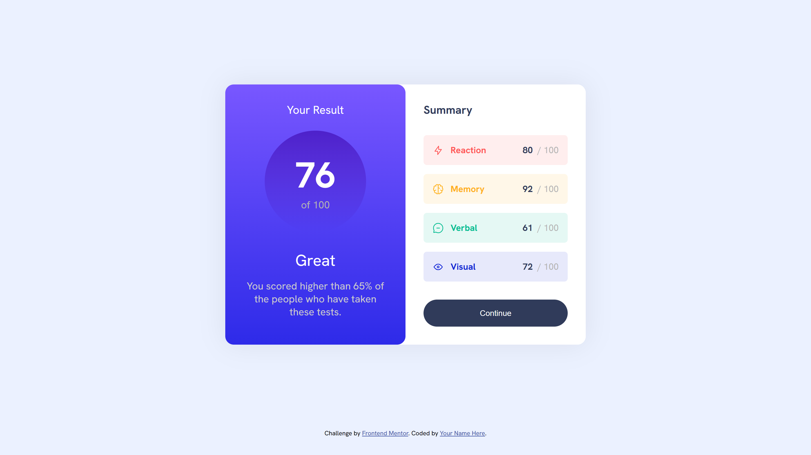
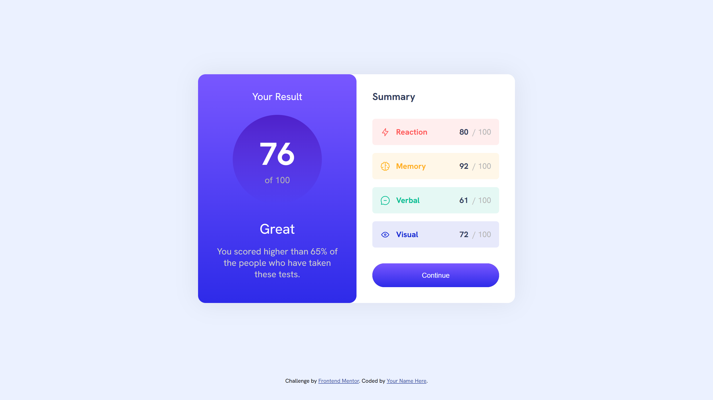
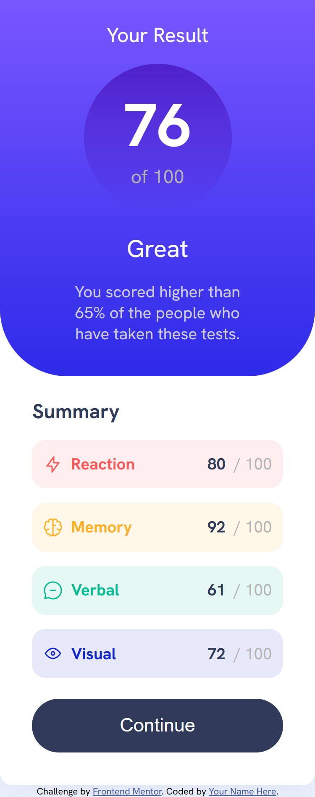

# Frontend Mentor - Results summary component solution

This is a solution to the [Results summary component challenge on Frontend Mentor](https://www.frontendmentor.io/challenges/results-summary-component-CE_K6s0maV). Frontend Mentor challenges help you improve your coding skills by building realistic projects.

### Screenshots

### Links

[- Solution URL](https://github.com/wolvsrcool/Frontend-Mentor/tree/master/results-summary-component-main)  
[- Live Site URL](https://wolvsrcool.github.io/Frontend-Mentor/results-summary-component-main/index.html)
